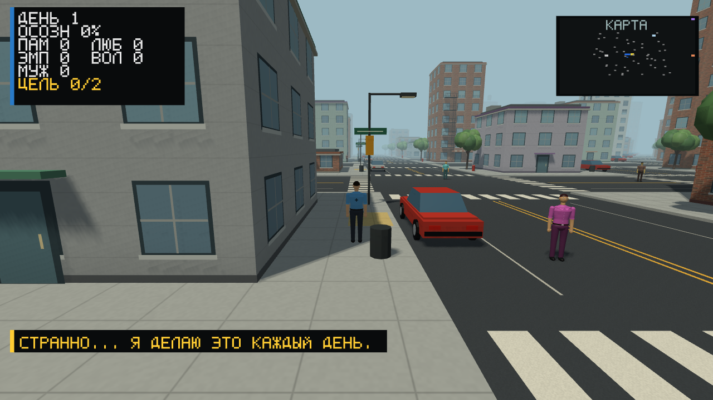
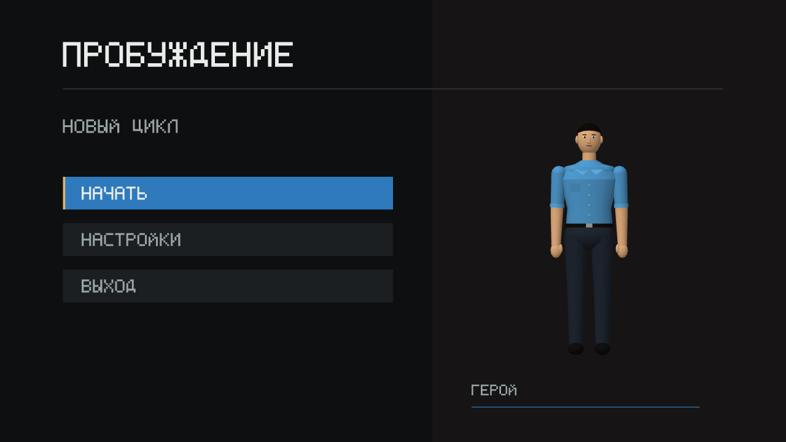

# Пробуждение

**Город забывает. Люди могут помнить.**

Игра от третьего лица о работнике городской службы, который замечает повторение
одного дня и учится менять чужие жизни собственными решениями.

Статус: **технический alpha-прототип** на C# / OpenTK. В интеграционной ветке
реализован первый эпизод с общим воспоминанием; три сюжетных утра ещё впереди.
Онлайн-сервера нет. Объединённые изменения проходят проверку в [PR #27](https://github.com/safal207/Awakening/pull/27).



## Направление

После ночной Сверки город возвращается к расписанию. Герой может сохранить
событие, если другой человек добровольно станет его свидетелем. Так появляются
якоря памяти, отношения и последствия, переживающие утро.

- [Оригинальная концепция и первый район](docs/CONCEPT.md)
- [Roadmap с этапами и критериями готовности](ROADMAP.md)
- [Вдохновение: Free Guy, темы и отличия](docs/INSPIRATION.md)
- [Художественное направление](docs/ART_DIRECTION.md)
- [Отдельная основа Unreal Engine: статус и запуск](unreal/README.md)
- [Широкие улицы, материалы и тени: нью-йоркская итерация](docs/MANHATTAN_REFRESH.md)
- [Архитектура и технические ограничения](SPECIFICATION.md)
- [Результаты проверок и воспроизведение](docs/VALIDATION.md)

## Что есть в прототипе

- Процедурный город из 21x21 квартала и 50 жителей с распорядками.
- Общая человеческая 3D-модель в городе и меню, лицо, одежда, анимация конечностей.
- Отдалённые персонажи рисуются с меньшей детализацией; герой остаётся подробным.
- Кирпич и камень, пожарные лестницы, баки на крышах, фонари и припаркованные машины.
- Проезжая часть 12 м, тротуары по 3 м, переходы, парковочная разметка и объёмные деревья.
- Освещение дня/ночи, солнечные тени, светящиеся окна, дымка и сглаживание MSAA 4x.
- Отсечение невидимого окружения и компактные статические GPU-буферы.
- Камера от третьего лица, осмотр героя, меню паузы и настройки.
- Диалоги, качества, находки и маркеры интереса.
- Первый эпизод Лиды и Марка: ремонт или задержка рейса, встреча и память после утра.
- Сохранение качеств, событий, состояний свидетелей, позиции героя и интерьера.
- Резервная копия, восстановление повреждённого прогресса, защита выхода при ошибке записи.
- Пассивная прибавка качеств при загрузке для осознания от 70%, до 12 часов.
- Автоматические проверки логики, снимки настоящего OpenGL-окна и профилировщик.

## Что ещё не готово

Три сюжетных утра, общая навигация без застреваний, выбранные занятия в отсутствие
игрока и совместная игра. Текущая развязка при 100% осознания - временная механика;
ожидание больше не повышает осознание. Пробуждение жителей переживает ночь,
но не все данные их текущего распорядка сохраняются. Несколько одновременно
запущенных игр пока могут конфликтовать при записи одного файла.



## Управление

| Клавиша | Действие |
|---|---|
| WASD | Движение |
| Shift | Бег |
| Мышь | Поворот камеры |
| Колесо или J/K | Приблизить/отдалить камеру |
| C | Вернуть камеру за спину героя |
| E | Контекстное взаимодействие: разговор, вход, выход |
| ЛКМ | Текущая реакция героя; это пока не замена взаимодействию E |
| Стрелки, Enter | Выбор реплики или пункта меню |
| Esc | Закрыть диалог / открыть меню паузы |

В меню можно выбирать пункты мышью. Зажмите ЛКМ на портрете, чтобы повернуть
героя. Влево/вправо поворачивают портрет, кроме настроек, где меняют значение.
Поддержка геймпада есть в коде; физический контроллер в этой проверке не использовался.

Личные фото и файлы моделей для работы над героем грузим через
`.\scripts\Import-HeroReferenceBundle.ps1 -Source <папка_или_файл>`.
Скрипт складывает сессию в `artifacts\hero-identity\reference-bundle` и ведёт
`manifest.json`, сам репозиторий не меняет.

## Сборка и запуск

Windows 10+, .NET 8 SDK, видеокарта с OpenGL 3.3 Core.

```powershell
dotnet restore Probuzhdenie.csproj
dotnet run --project Probuzhdenie.csproj -c Release
```

Или запустите `build_and_run.ps1`. Пользовательское сохранение лежит в
`%APPDATA%/Probuzhdenie/save.json`, настройки в
`%LOCALAPPDATA%/Probuzhdenie/settings.json`. Они не публикуются в репозитории.
Рядом с прогрессом находится одна резервная версия `save.json.bak`. При её
восстановлении последние изменения после этого снимка могут потеряться;
повреждённый оригинал остаётся в отдельном файле. [Правила восстановления](docs/SAVE_RECOVERY_2026-09-13.md).

## Проверка

```powershell
dotnet run --project Probuzhdenie.csproj -c Release -- --self-test
dotnet run --project Probuzhdenie.csproj -c Release -- --functional-test
dotnet run --project tests/GraphicsSmoke/GraphicsSmoke.csproj -c Release
dotnet run --project tests/GraphicsSmoke/GraphicsSmoke.csproj -c Release -- --playthrough
dotnet run --project Probuzhdenie.csproj -c Release -- --runtime-profile --profile-seconds=120
```

Графические тесты и профиль открывают окно. Запускайте их по очереди из корня
репозитория. Профиль использует отдельный тестовый мир и не читает/не перезаписывает
игровое сохранение. Оценки собственных GPU-буферов и текстур в JSON не равны полной
видеопамяти драйвера. После расширения улиц расстояния в мире изменились; поддерживаемый
прогресс загружается, точные позиции старый формат не сохранял. Версия 5 хранит
позицию и интерьер; небезопасная точка корректируется при загрузке. Проверки
прохождения включают 8 маршрутов, графические проверки - 26 сцен.

## Лицензия

Исходный код: [MIT](LICENSE). Проект не связан с правообладателями Free Guy.
Модель героя v3 и фотографии: [пакет референсов](assets/hero-reference/README.md).
Личные фотографии не входят в MIT-лицензию исходного кода.
Ресурсы фильма не включены; снимки сняты из нашей игры. Кирпичный материал создан
для проекта: [происхождение ресурса](assets/materials/README.md).
