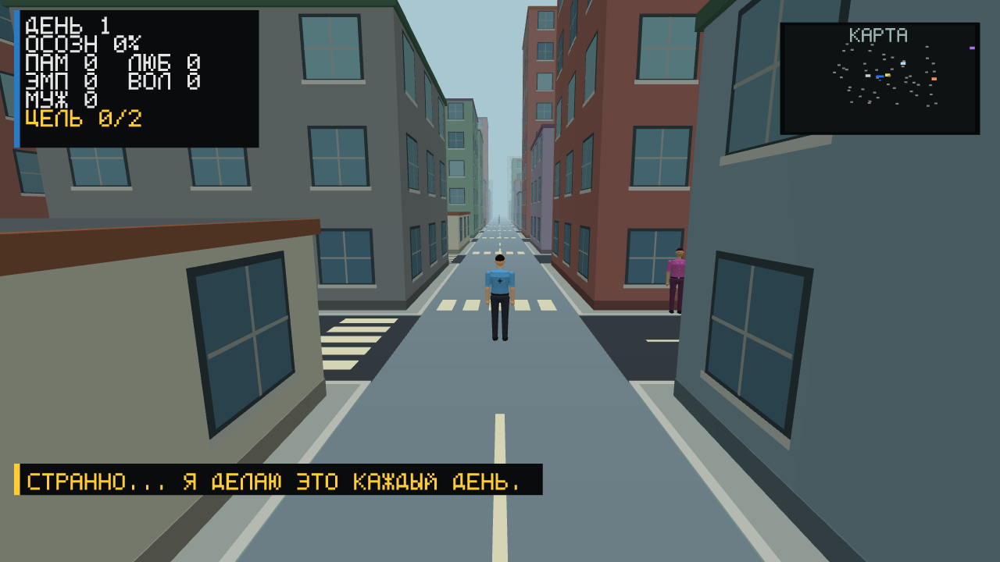

# Пробуждение

**Город забывает. Люди могут помнить.**

Игра от третьего лица о работнике городской службы, который замечает повторение
одного дня и учится менять чужие жизни собственными решениями.

Статус: **технический alpha-прототип** на C# / OpenTK. Новая история с общими
воспоминаниями описана в концепции, но ещё не реализована. Онлайн-сервера нет.



## Направление

После ночной Сверки город возвращается к расписанию. Герой может сохранить
событие, если другой человек добровольно станет его свидетелем. Так появляются
якоря памяти, отношения и последствия, переживающие утро.

- [Оригинальная концепция и первый район](docs/CONCEPT.md)
- [Roadmap с этапами и критериями готовности](ROADMAP.md)
- [Вдохновение: Free Guy, темы и отличия](docs/INSPIRATION.md)
- [Художественное направление](docs/ART_DIRECTION.md)
- [Архитектура и технические ограничения](SPECIFICATION.md)
- [Результаты проверок и воспроизведение](docs/VALIDATION.md)

## Что есть в прототипе

- Процедурный город из 21x21 квартала и 50 жителей с распорядками.
- Общая человеческая 3D-модель в городе и меню, лицо, одежда, анимация конечностей.
- Отдалённые персонажи рисуются с меньшей детализацией; герой остаётся подробным.
- Фасады с окнами и входами, дороги с разметкой, объёмные деревья и скамьи.
- Освещение дня/ночи, светящиеся окна, атмосферная дымка и сглаживание MSAA 4x.
- Камера от третьего лица, осмотр героя, меню паузы и настройки.
- Диалоги, качества, находки и маркеры интереса.
- Сохранение основных качеств и части состояния жителей.
- Пассивная прибавка качеств при загрузке для осознания от 70%, до 12 часов.
- Автоматические проверки логики, снимки настоящего OpenGL-окна и профилировщик.

## Что ещё не готово

Якоря памяти, три сюжетных утра, выбранные занятия в отсутствие игрока, полная
устойчивость сохранений, постоянное пробуждение жителей и совместная игра.
Текущая развязка при 100% осознания - временная механика. Автоматический рост
осознания и неполная память NPC мешают задуманному циклу и стоят первыми в M1.


## Управление

| Клавиша | Действие |
|---|---|
| WASD | Движение |
| Shift | Бег |
| Мышь | Поворот камеры |
| Колесо или J/K | Приблизить/отдалить камеру |
| C | Вернуть камеру за спину героя |
| E | Контекстное взаимодействие: разговор, вход, выход |
| ЛКМ | Текущая реакция героя; это пока не замена взаимодействию E |
| Стрелки, Enter | Выбор реплики или пункта меню |
| Esc | Закрыть диалог / открыть меню паузы |

В меню можно выбирать пункты мышью. Зажмите ЛКМ на портрете, чтобы повернуть
героя. Влево/вправо поворачивают портрет, кроме настроек, где меняют значение.
Поддержка геймпада есть в коде; физический контроллер в этой проверке не использовался.

## Сборка и запуск

Windows 10+, .NET 8 SDK, видеокарта с OpenGL 3.3 Core.

```powershell
dotnet restore Probuzhdenie.csproj
dotnet run --project Probuzhdenie.csproj -c Release
```

Или запустите `build_and_run.ps1`. Пользовательское сохранение лежит в
`%APPDATA%/Probuzhdenie/save.json`, настройки в
`%LOCALAPPDATA%/Probuzhdenie/settings.json`. Они не публикуются в репозитории.

## Проверка

```powershell
dotnet run --project Probuzhdenie.csproj -c Release -- --self-test
dotnet run --project Probuzhdenie.csproj -c Release -- --functional-test
dotnet run --project tests/GraphicsSmoke/GraphicsSmoke.csproj -c Release
dotnet run --project Probuzhdenie.csproj -c Release -- --runtime-profile --profile-seconds=120
```

Графические тесты и профиль открывают окно. Запускайте их по очереди из корня
репозитория. Профиль использует отдельный тестовый мир и не читает/не перезаписывает
игровое сохранение. Собственные GPU-буферы в JSON не равны полной видеопамяти драйвера.

## Лицензия

Исходный код: [MIT](LICENSE). Проект не связан с правообладателями Free Guy.
Ресурсы фильма не включены; опубликованные изображения сняты из нашей игры.
