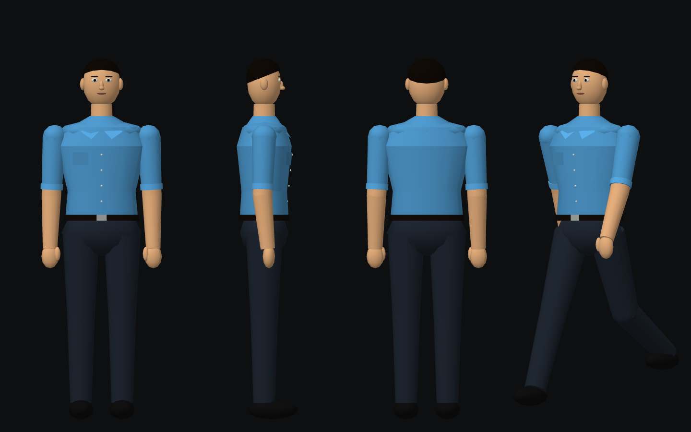
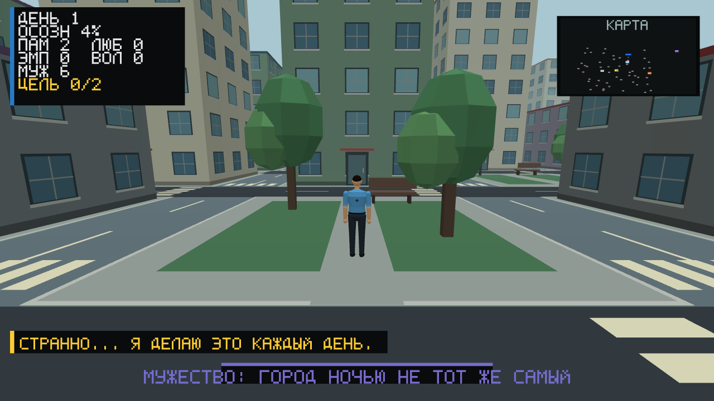
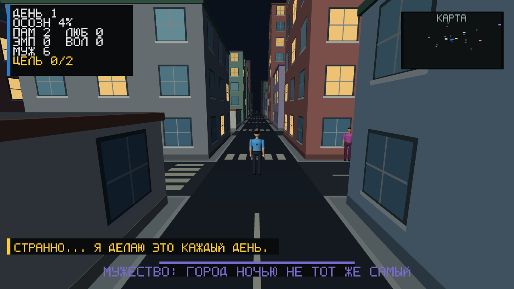

# Художественное направление

## Не декорация, а человек

Стиль: выразительный low-poly, ясные формы, обычный обжитой город.
Не фотореализм и не кубический конструктор. Голубая рубашка должна читаться
на фоне разных материалов и в тени. У героя узнаваемы лицо, шея, плечи,
локти, ладони, колени и обувь; сбоку он не превращается в прямоугольник.

В этом изменении меню и игровой мир используют одну модель. Появились
пропорциональный корпус, лицо с носом и глазами, волосы, воротник, карман,
пуговицы, ремень, суставы и дыхание в покое. В меню можно осмотреть модель
со всех сторон. Это процедурный персонаж, не скан и не портрет актёра.

## Город

Материалы различаются, а не окрашиваются одним оттенком:

| Элемент | Направление |
|---|---|
| Герой | Голубая рубашка, тёмные брюки, натуральная кожа |
| Фасады | Шалфейный, кирпично-красный, меловой, серо-зелёный, приглушённый лиловый |
| Улица | Нейтральный асфальт, светлые бордюры и разметка |
| Растения | Матовая листва с объёмом, ствол, спокойные вариации зелени |
| Ночь | Холодное небо и локальные тёплые окна, без неоновой заливки |

У окон есть рамы и подоконники, у зданий входы и козырьки, у скверов скамьи.
Поверхности должны оставаться видимыми с правильной стороны. Деревья больше
не рисуются поверх закрывающих их зданий. Дальний город постепенно теряет
контраст через дымку.

Пока архитектура всё ещё повторяется, а настоящих теней нет. Следующий шаг -
силуэт депо, небольшие дворики, характерные детали и контакт с землёй, а не
увеличение числа одинаковых домов.

## Пробуждение через детали

Планируемый приём: первоначально вещи совпадают с расписанием. После общей
памяти появляются личные следы: оставленная записка, незапланированный стул,
приветственный жест, рисунок на обороте таблички. Изменение можно заметить
без цветной шкалы. Эти сюжетные детали ещё не реализованы.

## Камера и интерфейс

Камера спокойная, от третьего лица, ближе к росту человека. Герой не должен
исчезать в собственном силуэте или закрывать собеседника. Меню показывает
реальную модель, не отдельную картинку. Название читается сразу, пункты и
портрет не пересекаются. Поворот портрета не активирует соседние пункты.

Нынешний пиксельный шрифт и компактный HUD - переходный вариант. Следующая
итерация: читаемая русская гарнитура, перенос длинных реплик, подробные качества
в отдельном экране. Мини-карте нужны реальные улицы и различимые обозначения.

## Технические ограничения

Статическое окружение создаётся один раз, персонажи используют общую модель
с уменьшением детализации вдали. После каждого заметного добавления геометрии
нужны кадры из игры и повторный профиль. Картинка без измерений не считается
законченной работой.

Все изображения здесь сняты из тестового окна текущей игры; время и положение
камеры заданы тестом. Это не рекламные рендеры и не обещание реализованного сюжета.
