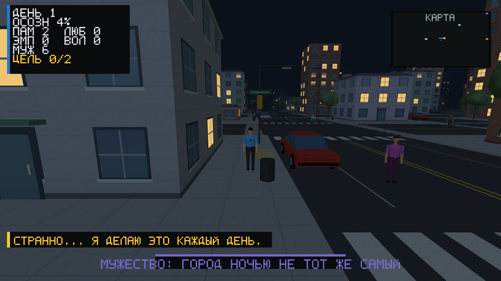
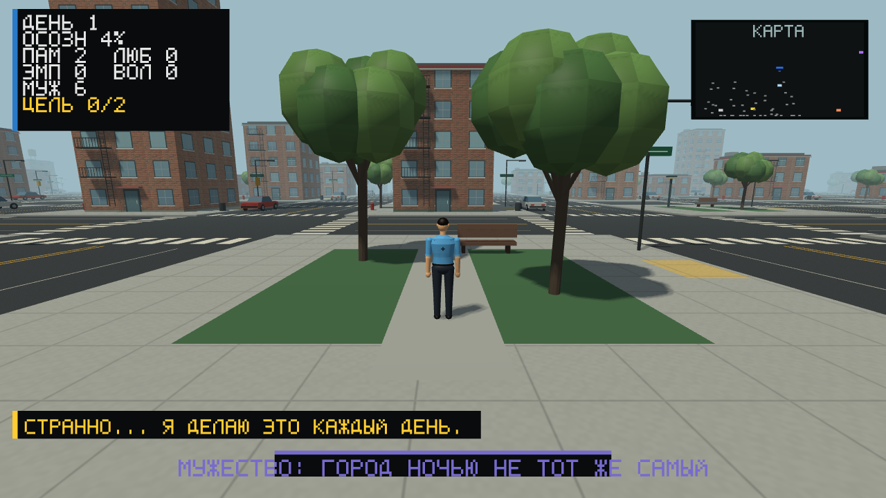

# Улицы и материалы: нью-йоркское направление

10 сентября 2026 года. Вторая графическая итерация после общей модели человека.
Это работающая графика текущего OpenTK-прототипа, не концепт-арт и не новый движок.

## Образ района

Выбран характер нижнего Манхэттена: кирпичная застройка, каменные фасады,
наружные пожарные лестницы, оборудование крыш и баки, деревья вдоль тротуаров.
Мера остаётся вымышленным городом. Реальная карта Нью-Йорка, адреса и здания
не импортировались; кварталы имеют условный игровой масштаб.

Официальные визуальные и архитектурные ориентиры:

- [NYC DOT: материалы тротуаров](https://www.nycstreetdesign.info/material/sidewalks).
- [NYC DOT: проектирование тротуаров](https://www.nycstreetdesign.info/node/76).
- [NYC Planning: исторические ресурсы Hudson Square](https://www.nyc.gov/assets/planning/download/pdf/applicants/env-review/hudson_square/07_feis.pdf).

Это источники направления, а не заявление о соответствии муниципальным нормам.
Фотографии из этих источников в игру не включены. Кирпичная текстура создана
специально для проекта: [происхождение и промпт](../assets/materials/README.md).


## Реализовано

- Проезжая часть 12 игровых метров, тротуары по 3 метра. Уличный коридор 18 метров.
- Поднятые на 12 см тротуары, двойная осевая разметка, переходы и парковочные полосы.
- Высота ног героя и NPC учитывает дорогу/тротуар, в том числе после выхода из здания.
- Кирпичная текстура с mipmaps, швы камня и бетона, мелкая фактура асфальта.
- Стёкла меняют отклик с углом взгляда; это приближение отражения неба, не отражение сцены.
- Солнечная карта теней 2048x2048 для домов, деталей и персонажей, с фильтрацией краёв.
- Раздельный дневной/ночной вклад света; тёплые окна ночью.
- Исправлена интерполяция глубины для дымки на больших полигонах: ближний асфальт
  больше не получает цвет далёкого неба из-за вершин за камерой.
- Пожарные лестницы, карнизы, баки, фонари, гидранты, урны, припаркованные машины.
- Многосоставные кроны и сглаженные нормали листвы.
- Статические объекты вне поля зрения и слишком далеко не отправляются на отрисовку.
- Переключатель солнечных теней в настройках, сохранение его значения.

Машины пока неподвижны, но их корпуса блокируют проход. Ночные фонари пока не
дают локального света на асфальт; окна светятся без полноценного освещения окружения.





## Память и совместимость

Окружение создаётся при загрузке, а не заново каждый кадр. Для статических вершин
используются позиции float32, цвета float16 и нормали snorm16: 28 вместо 36 байт.
Упаковка сохраняет координаты и топологию, но слегка округляет цвет/нормаль.
Временный буфер упаковки ограничен 16 384 вершинами. Динамическая модель героя
остаётся в прежнем формате. Карта теней и текстуры имеют явное освобождение.

Сетка изменилась: шаг участка теперь 28 вместо 14 игровых метров. Seed и порядок
выбора типов участков сохранены, но физические расстояния и расположение жителей
после генерации другие. Формат сохранения не менялся: имеющиеся качества, находки
и поддерживаемые отношения загружаются по прежним правилам. Старый формат не
сохраняет точную позицию героя; полной миграцией снимка мира это не является.
Настоящие пользовательские сохранения во время тестов не перезаписывались.

## Проверки

- Release-сборка игры и GraphicsSmoke без ошибок и предупреждений.
- Функциональные тесты и отдельная самопроверка сохранения/загрузки.
- Проверки ширины улиц, высот на отрицательных координатах, появления героя и коллизии машины.
- Проверки отсечения перед/за камерой, вне экрана, возле камеры и вдали.
- Проверки размера и смещений упакованной вершины, точности цвета и знаковых нормалей.
- Десять кадров настоящего окна: меню, настройки, повороты героя, день, вечер, ночь, сквер, интерьер.
- Включение/отключение теней изменило яркость 44 493 пикселей дневной сцены выше порога теста.
- Ввод меню, перетаскивание портрета, вход в интерьер, движение, сворачивание и восстановление.
- Ошибок OpenGL в сценарии снимков не обнаружено.

Снимки проверены при 960x540, 1280x720, 960x900 и 1440x900. Окно Full HD также
запрашивалось, но его высота ограничивается рабочей областью тестового дисплея.
Это не полная проверка всех DPI или физических контроллеров.

Сырые локальные результаты сохраняются в `artifacts/manhattan-refresh`.
Нулевой профиль сценария снимков не является измерением производительности.

### Завершённый контрольный профиль

После прерванных попыток выполнен согласованный контрольный прогон на 180 секунд.
Диагностический журнал всё время показывал 1280x720 и `WindowState.Normal`.
Seed 424242, 50 жителей, VSync выключен, MSAA 4x, солнечные тени включены.
AMD Radeon(TM) Graphics, OpenGL 3.3 Core, драйвер 22.40.76.230711.

| Метрика | Результат |
|---|---|
| Завершение | Штатное, Interrupted=false |
| Активное / общее время | 180,00 / 180,06 с |
| Кадры / средний FPS | 12 667 / 70,37 |
| p50 / p95 / p99 кадра | 13,47 / 20,72 / 28,37 мс |
| Самый долгий кадр | 445,97 мс |
| Выделения основного потока | 636,8 байт/кадр |
| Управляемая память: начало / конец / пик | 22,48 / 11,30 / 22,66 МиБ |
| GC Gen0 / Gen1 / Gen2 | 4 / 1 / 1 |
| Собственные GPU-буферы: конец / пик | 127,49 / 127,49 МиБ |
| Текстуры с mipmaps и картой теней: конец / пик | 24,00 / 24,00 МиБ |

17 системных замеров примерно с 16-й по 177-ю секунду процесса:
dedicated 68,79-69,81 МиБ; shared 183,73-196,38 МиБ, последний 188,42 МиБ;
committed 245,26-257,94 МиБ, последний 249,96 МиБ. Эти категории и оценку
собственных буферов нельзя складывать как независимую память. В наблюдавшемся
интервале нет монотонного роста выделенных GPU-ресурсов, но это не доказательство
отсутствия долговременной утечки.

До упаковки та же геометрия занимала 161,25 МиБ собственных буферов, после
упаковки 127,49 МиБ: снижение примерно на 21% без сокращения числа треугольников.
Ранний 120-секундный профиль до упаковки давал 94,53 FPS; это другой прогон
в неизолированной среде, не основание утверждать ускорение или замедление от упаковки.

**Бюджет p95 до 16,7 мс и p99 до 25 мс в завершённом прогоне не достигнут.**
Средние 70 FPS не означают постоянные 60 FPS. Есть стартовый/единичные длинные
кадры; точная причина максимального пика отдельно не установлена. Прогрев включён
в статистику. GPU timestamp и все выделения всех потоков не измерялись;
на рабочем компьютере могли выполняться другие задачи.

[Полный JSON](measurements/manhattan-final-180s.json),
[системные GPU-счётчики](measurements/manhattan-final-gpu.csv).

Воспроизведение из корня репозитория:

```powershell
dotnet run --project tests/GraphicsSmoke/GraphicsSmoke.csproj -c Release -- --runtime-smoke --runtime-profile --profile-seconds=180 --profile-output=artifacts/manhattan-refresh/runtime-180s.json
```

Готовая локальная сборка с ресурсами: `artifacts/manhattan-refresh/playable/Probuzhdenie.exe`.
Она требует установленный .NET 8. Публикация сборки проверена; отдельная самопроверка
сохранения/загрузки запущена из этой папки успешно. Снимки и профиль используют
те же Release-бинарники, а не отдельную демонстрационную сцену.

### Незавершённые длительные попытки

Первая попытка на 600 секунд была остановлена после обнаружения свёрнутого окна:
20,66 с активной отрисовки за 463,02 с работы процесса. Она исключена из итогового FPS.
При повторе диагностический журнал подтвердил непрерывную работу примерно до
425-й секунды, затем сворачивание и восстановление ближе к 590-й секунде.
Защитный таймер штатно завершил процесс: `Interrupted=true`, 455,86 с отрисовки
за 615,01 с общего времени, 38 602 кадра. На активных участках среднее 84,68 FPS,
p95 16,50 мс, p99 23,54 мс, максимум 469,74 мс. Эти значения не выдаются за
успешный непрерывный десятиминутный тест. Пауза не является зависанием renderer.

Отчёт этой попытки: [manhattan-partial-600s.json](measurements/manhattan-partial-600s.json).
Системные замеры, включая период паузы: [manhattan-partial-gpu.csv](measurements/manhattan-partial-gpu.csv).
Прогон на 10-15 минут без сворачивания, с повторными входами в меню/здания,
остаётся незавершённой проверкой. Стабильность долговременной памяти не доказана.

## Что дальше для реалистичности

Сейчас это более детальная стилизация. Геометрия машин и людей ещё упрощённая,
фасады повторяются, зелень не использует настоящие карточки листьев. До уровня
современной крупной игры нужны авторские модели и анимации, полноценные PBR-наборы,
детализация земли, локальный свет, отражения, художественная работа над районами
и дальнейшая оптимизация. Трассировки лучей, сканированных улиц и фотореализма нет.

Маршруты NPC пока не обходят препятствия по полноценному графу улиц. Столкновения
мелких предметов, камера возле машин и мебель внутри зданий требуют отдельной работы.
Это не сетевое обновление: онлайн остаётся в будущих этапах roadmap.
